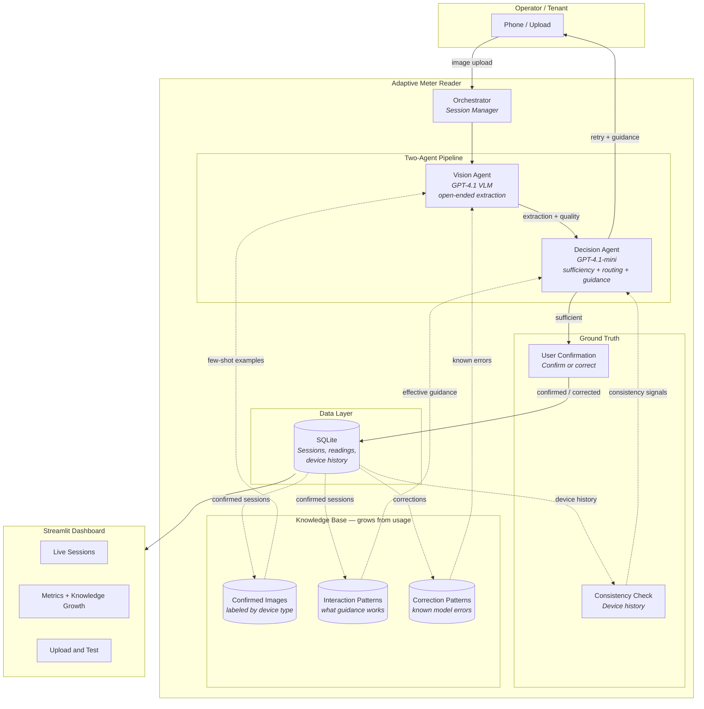
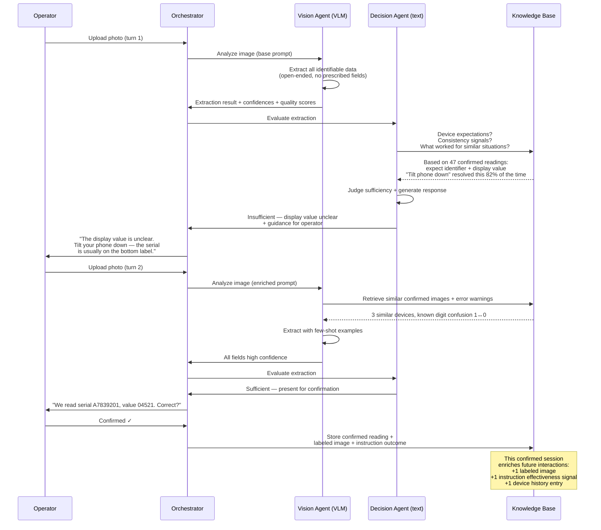
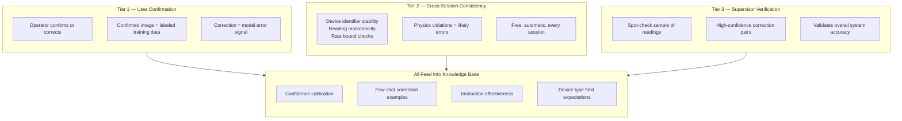
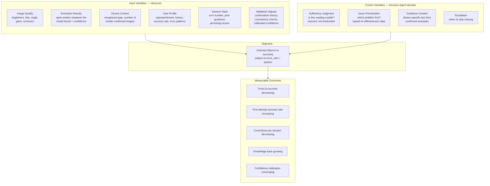
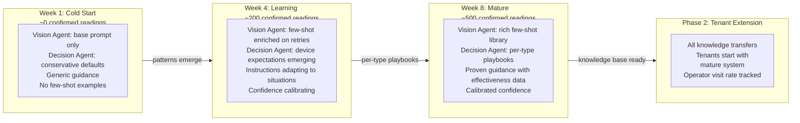
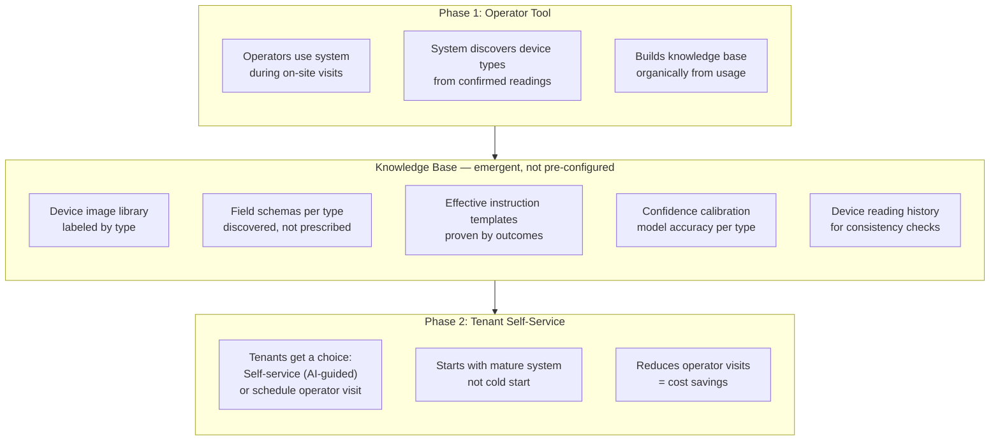
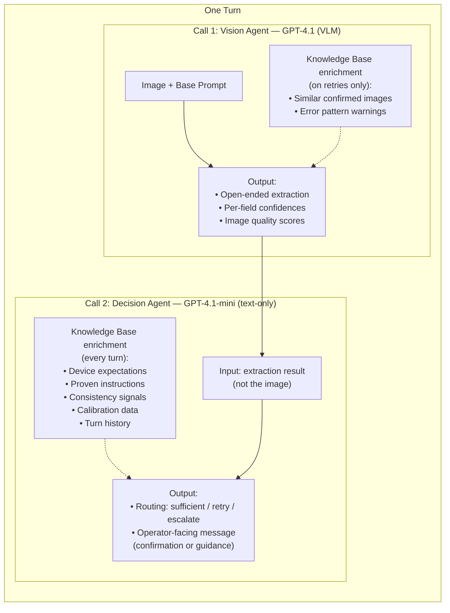

# System Architecture

## Architecture Overview

The Adaptive Meter Reader is an AI system that helps operators capture correct utility meter readings during on-site visits. The core challenge: meter devices vary enormously (heat cost allocators, water meters, gas meters), image quality is unpredictable (dark hallways, glare, obstructed devices), and the system must work reliably from day one while improving over time.

The system uses a **2-agent pipeline** — each upload triggers exactly two LLM calls. The **Vision Agent** (GPT-4.1, multimodal) performs open-ended extraction from the meter image: it discovers whatever fields are present (serial numbers, display values, device identifiers) without a prescribed schema, and reports per-field confidence scores alongside image quality assessment. The **Decision Agent** (GPT-4.1-mini, text-only) then evaluates the extraction and decides the routing: accept the reading as sufficient, request a retry with specific guidance, or escalate to a supervisor. This separation keeps the expensive vision call focused on perception while the cheaper text model handles judgment and communication.

The system learns from every confirmed reading through **three validation tiers**. First, operator confirmation: the user confirms or corrects the extracted values, producing labeled training data. Second, cross-session consistency: the system checks device identifier stability, reading monotonicity, and physical rate bounds across visits. Third, periodic supervisor verification of a sample of readings. All three tiers feed into a **knowledge base** of three ChromaDB collections — confirmed images (for few-shot prompting), interaction patterns (which guidance works), and correction patterns (known model errors). This knowledge enriches future prompts: the Vision Agent gets relevant examples on retries, and the Decision Agent gets device-type expectations, proven instructions, and calibrated confidence thresholds.

At **cold start** (week 1), the system operates on base prompts with conservative defaults. As confirmed readings accumulate (~200 by week 4), device-specific patterns emerge: the system learns what fields to expect per device type, which photo instructions actually help, and where the model tends to make errors. By week 8 (~500 readings), the system has mature per-device-type playbooks with calibrated confidence, proven guidance, and a rich few-shot library. This knowledge base then becomes the foundation for a Phase 2 tenant self-service extension — tenants start with a mature system, not a cold start.

The **optimization objective** is to minimize expected turns-to-success while keeping reading error rate below a threshold — measured against real ground truth from confirmations, not self-reported model confidence.

---

## 1. High-Level System Overview

The diagram below shows the full system topology: the 2-agent pipeline at the center, the knowledge base that grows from confirmed readings, the SQLite data layer that tracks sessions and device history, and the Streamlit dashboard for monitoring. Dashed lines represent knowledge enrichment — how confirmed data flows back into future prompts.

## 2. Session Lifecycle

This sequence diagram traces a typical multi-turn interaction. Turn 1 produces an insufficient extraction (display value unclear), so the Decision Agent retrieves proven guidance from the knowledge base and instructs the operator to tilt the phone. Turn 2 succeeds with knowledge-enriched few-shot prompting, the operator confirms, and the confirmed session feeds back into the knowledge base — closing the learning loop.

## 3. Knowledge Base Growth

Every confirmed session produces five distinct learning signals. These flow into four knowledge stores that directly improve system behavior: a device image library for few-shot prompting, learned field schemas for setting expectations, confidence calibration data for better accept/reject thresholds, and proven instruction templates for more effective guidance.

```mermaid
graph LR
    subgraph Input["Every Confirmed Session Produces"]
        direction TB
        A[Labeled Image<br/><i>photo + confirmed device type</i>]
        B[Field Structure<br/><i>what fields exist for this type</i>]
        C[Ground Truth Values<br/><i>the confirmed reading</i>]
        D[Extraction Quality<br/><i>model correct or wrong per field</i>]
        E[Instruction Outcome<br/><i>did the guidance work?</i>]
    end

    subgraph KB["Knowledge Base"]
        direction TB
        KB1[Device Image Library<br/><i>few-shot prompting<br/>→ Vision Agent</i>]
        KB2[Learned Field Schemas<br/><i>what to expect per type<br/>→ Decision Agent</i>]
        KB3[Confidence Calibration<br/><i>model confidence → actual accuracy<br/>→ Decision Agent</i>]
        KB4[Effective Instructions<br/><i>what works for what<br/>→ Decision Agent</i>]
    end

    subgraph Benefits["Feeds Back Into"]
        direction TB
        R1[Better device recognition]
        R2[Better extraction accuracy]
        R3[Better accept/reject decisions]
        R4[Better guidance]
    end

    Input --> KB
    KB --> Benefits
    Benefits -->|more confirmed readings| Input
```

## 4. Ground Truth Validation Tiers

The system never relies on model self-confidence alone. Three independent validation tiers provide ground truth. Tier 1 (user confirmation) is the primary source — every confirmed or corrected reading is a labeled data point. Tier 2 (cross-session consistency) catches physics violations for free by comparing readings across visits to the same device. Tier 3 (supervisor verification) provides periodic spot-checks that validate overall system accuracy.

## 5. Optimization Problem

The Decision Agent solves a constrained optimization problem every turn. The inputs are observed variables (image quality, extraction results, device context, user profile, session state, validation signals). The controls are the Decision Agent's choices: sufficiency judgment, issue prioritization, guidance content, and escalation timing. The objective is to minimize expected turns-to-success while keeping reading error rate below a threshold — where both metrics are measured against real ground truth, not model self-assessment.

## 6. System Evolution

This timeline shows how the system matures from cold start to production readiness. In week 1, the agents operate on base prompts with no examples. By week 4, device-specific patterns emerge from ~200 confirmed readings. By week 8, the system has mature per-type playbooks, calibrated confidence, and proven guidance. The accumulated knowledge base then enables Phase 2: tenant self-service, where tenants inherit a mature system rather than starting cold.

## 7. Rollout Vision

The two-phase rollout strategy uses Phase 1 (operator tool) to organically build the knowledge base that Phase 2 (tenant self-service) depends on. Operators generate labeled training data through normal usage — no separate data collection effort needed. The knowledge base contents (device image library, discovered field schemas, proven instructions, calibration data, device history) all emerge from confirmed readings rather than manual configuration.

## 8. Two-Agent Prompt Architecture

This diagram details the internal structure of one turn through the pipeline. The Vision Agent receives the image plus a base prompt (enriched with few-shot examples and error warnings on retries). It outputs open-ended extraction results with per-field confidences and image quality scores. The Decision Agent receives only the text extraction (not the image), enriched with device expectations, proven instructions, consistency signals, calibration data, and turn history. It outputs a routing decision and an operator-facing message.

